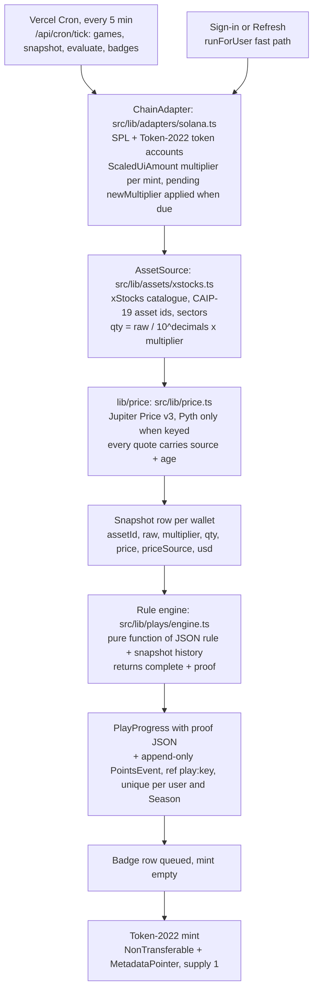
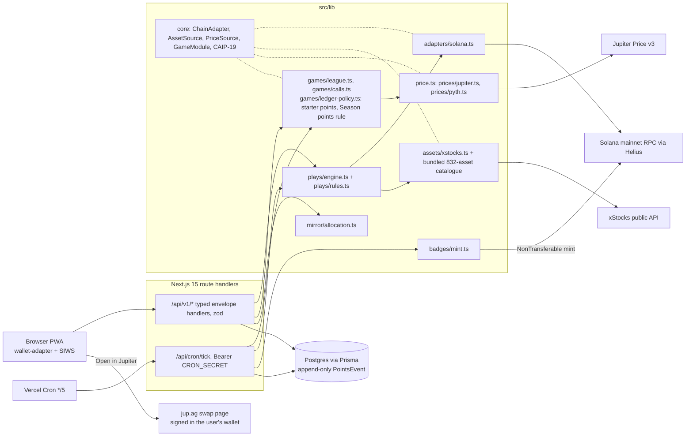

# Dulo

**The entertainment layer for xStocks. Compete, predict and get rewarded, for points.**

Three games on one Season leaderboard: points-only **predictions** on Friday closes, a weekly **competition** with $10,000 of virtual cash at real xStock prices, and **quests**, some completed in the app and some verified from your own Solana wallet with the proof attached. Every new player starts with 1,000 starter points. Points only, no cash value.

<!-- CI badge goes here once github.com/dulofun/dulo is public: [](https://github.com/dulofun/dulo/actions/workflows/ci.yml) -->

**Not deployed yet: there is no public URL, no players and no minted badge.** Everything below runs from this repo against Solana mainnet. The hosted link and the videos go in this row on submission.

`Live app: <LIVE_URL>` · `Pitch video: <PITCH_VIDEO>` · `Technical video: <TECH_VIDEO>` · [Stocklana hackathon](https://hackathons.solana.com/hackathons/stocklana) · [MIT licence](LICENSE)

Built for the Stocklana hackathon: submissions close Fri 25 Sep 2026, 16:00 ET, and judging runs to 2 Oct.

<!-- Screenshots (docs/screenshots/, 1280x800 and 390 px) go here once captured. Do not link images that are not in the repo. -->

---

## Judge quick path (5 minutes to run it, then 90 seconds of clicking)

**There is no hosted demo yet, so run it locally first: [Run locally](#run-locally), about 5 minutes.** Every chain read goes to Solana mainnet, so nothing here is a testnet mock. You do not need to hold an xStock: starter points and virtual cash cover everything except the on-chain quests.

The landing opens on this week's live prediction cards, the three game tiles (Predictions, Competition, On-chain quests) and the welcome offer, with Connect wallet first and Check a wallet second.

1. **Connect.** Phantom, Solflare or another Wallet Standard wallet such as Backpack, then sign one message (Sign-In With Solana). No transaction.
2. **Welcome.** Your first sign-in writes 1,000 starter points to the ledger, and the toast says so: 1,000 starter points for predictions and $10,000 of virtual cash for this week's competition. The account menu shows a points balance of 1,000 and Season points of 0, "Not ranked yet", because starter points never count toward rank.
3. **Predict.** On `/predictions`, put points on Yes or No: will NVDA, TSLA or SPY close above the strike on Friday? The dialog defaults to 100 points. First Prediction (+50) completes in the same request, and you are on the Season leaderboard with 50 Season points. The 100 points you put in only count once the prediction settles.
4. **Compete.** On `/competition` (the weekly competition, virtual cash), place paper trades in three different xStocks with virtual cash at Jupiter prices, with a $10 minimum per trade. First Paper Trades (+50) and Paper Portfolio (+75) complete in the same requests. Your rank updates live against the labelled house bots, and weekend trades count too.
5. **Quests.** On `/quests`, filter by All, In-platform, On-chain or Badges. In-platform quests show your next steps (Ten Paper Trades, Five Predictions and the rest). On-chain quests each describe a wallet state and open a proof once complete. If your wallet holds $5 or more of any xStock, First Position usually lands within seconds of sign-in.

Two more things to try, and the first needs no sign-in:

- **Check a wallet.** Under "Check any wallet" on the landing, tap **Public holder A** or paste any Solana address. `/check/<address>` reads that wallet's xStocks live from Token-2022 balances and runs every live on-chain quest against that one read. Nothing is stored or scored.
- **Copy a portfolio.** On `/copy`, pick a public wallet, enter a USDC budget and open one prefilled Jupiter swap per leg. You sign each swap in your own wallet, then press "I've done my swaps"; if the next snapshot is within 20% of the allocation, Portfolio Match (+500) completes. You can skip the swaps on a first look.

## What it is

**The entertainment layer for xStocks. Compete, predict and get rewarded, for points.**

Predict. Compete. Complete on-chain quests.

- **Today:** the entertainment layer for xStocks. Competitions, predictions and rewards for people who hold xStocks on Solana, verified from their own wallets.
- **Next:** the entertainment layer for tokenized assets, since every asset read sits behind one interface.
- **Then:** any app or issuer runs competitions, predictions and rewards for its own holders on Dulo's API, and a player carries one score across them.

800,000+ Solana addresses hold a tokenized stock (Blockworks via Solana Compass, 12 Sep 2026). Getting someone to buy once is the easy part. Giving them a reason to keep holding, diversify and add over time is harder, and every app building on tokenized stocks has to find those holders on its own.

Dulo gives those holders, and anyone curious about xStocks, three games that share one Season leaderboard:

- **Predictions.** Points-only Yes or No on Friday closes.
- **Competition.** A weekly trading competition with $10,000 of virtual cash at real xStock prices. It is not real money, not real trading and not swaps.
- **Quests.** Verified actions. In-platform quests are completed with virtual cash and points. On-chain quests are verified from your own wallet: Dulo reads it from Solana, checks the JSON rule, keeps the proof and scores it in a **Season**. Projects list on-chain quests as rows.

Copy a portfolio is a tool, not a fourth game. Season 0, the Stocks Season, reads xStocks on Solana mainnet.

### Pages

The nav reads Predictions · Competition · Quests · Copy a portfolio · Leaderboard, and the phone tab bar reads Predict · Compete · Quests · Board · Profile.

| Page | What it shows | Sign-in |
|---|---|---|
| `/` | The landing: this week's live prediction cards, the three game tiles, the welcome offer and check any wallet | no |
| `/predictions` | Predictions: points-only Yes or No on Friday closes | to predict |
| `/competition` | Weekly competition (virtual cash): trade form, positions and the board with labelled house bots | to trade |
| `/quests` | Quests: in-platform, on-chain and coming soon, with a proof on every completed on-chain quest | to earn |
| `/copy`, `/copy/<wallet>` | Copy a portfolio: pick a wallet, see its allocation, open one Jupiter link per leg | to verify |
| `/check`, `/check/<address>` | Check any wallet: a live read of its xStocks and the on-chain quests it meets, nothing stored | no |
| `/leaderboard` | The Season leaderboard, ranked by Season points, real players only | no |
| `/profile` | Points balance, Season points, points history and badges | yes |
| `/partners`, `/partners/<slug>` | Listed projects, their quests and verified completions | no |

The page paths from before 16 Sep (/plays, /rewards, /league, /paper-trading, /calls and /mirror) redirect permanently to these. The `/api/v1` paths did not move.

There is no deposit, no custody, no broker login and no Anchor program. The only transaction this codebase sends is a soulbound badge mint from a server wallet. Every swap is signed in Jupiter, in the user's own wallet.

Dulo is independent and not affiliated with xStocks. Backed Finance owns that brand.

## Judging criteria

| Criterion | What Dulo shows |
|---|---|
| **Real user and problem** | 800,000+ Solana addresses hold a tokenized stock (Blockworks via Solana Compass, 12 Sep 2026). Holders need a reason to keep holding after the first buy, and apps need a way to reach them. On-chain quests pay points for holding, diversifying, buying steadily and holding through earnings, never for trading volume. Newcomers who hold nothing still get a full game: starter points for predictions and virtual cash for the competition. A listed project's on-chain quests are JSON rows on its campaign, and its page shows the verified completions it drove. Season 0 partners are seeded by hand, no project has signed up yet, and nothing is deployed, so every count reads zero. |
| **Working end-to-end demo** | Reads Solana mainnet. Anyone can check any wallet without signing in. A SIWS sign-in grants starter points and starts scoring. In-platform quests complete in the same request as the trade or prediction. On-chain quests are verified at sign-in and by a 5-minute cron. The weekly competition and the weekly points-only predictions both settle and roll over on their own. Copying a portfolio hands off to prefilled Jupiter swaps, and quests that carry a badge queue a soulbound Token-2022 badge mint (see [Proof on mainnet](#proof-on-mainnet)). It keeps working with US markets closed. |
| **Why Solana** | Holdings are public state, so an on-chain quest is checked from RPC, not claimed by a broker. Token-2022 ScaledUiAmount gives multiplier-correct holdings. Jupiter quotes and swaps the xStock mint itself. Badges are NonTransferable Token-2022 mints. See [Why Solana](#why-solana). |
| **Execution quality** | Chain reads, asset math and prices each sit behind one interface, and asset ids are CAIP-19. Points are an append-only ledger with a unique ref per row, one Season points rule shared by every board, and house bots filtered in the database. 1,176 tests across 56 files pass today (`npx vitest run`, 21 Sep 2026), and CI runs lint, typecheck, tests and a production build on every push. The app is an installable PWA with security headers and rate-limited public endpoints. MIT licence. |

## How points work

Points only, no cash value. Points live in an append-only `PointsEvent` ledger with a unique ref on every row, and every number below is a sum over that ledger.

- **Three games, one Season leaderboard.** Predictions, the weekly competition (virtual cash) and quests all feed the same Season points. Copy a portfolio is a tool, and a verified copy completes the Portfolio Match quest.
- **1,000 starter points on first sign-in,** once per player per Season. You can put them into predictions, they have no cash value, and they never count toward Season points or rank. House bots never get them.
- **$10,000 of virtual cash per competition week.** It is neither real money nor points. Your competition account opens with your first paper trade, and the app never adds cash and points into one number.
- **Season points = quests + weekly finishes (top 10 with 3+ trades) + settled prediction results.** Starter points, house seed rows and points in open predictions are left out. A prediction counts once it settles: the points back if it settles your way, minus the points you put in if it does not, and zero on a refund.
- **Weekly finishes.** Ranks 1 to 10 by virtual portfolio value earn 1,000 / 700 / 500 / 300 / 200 / 100 / 100 / 100 / 100 / 100 points. Only real accounts with at least 3 trades that week are paid, so a place held by a house bot pays nobody.
- **Quests.** The 8 in-platform quests are worth 850 points and use virtual cash and points. The 9 on-chain quests are worth 2,700 points and are verified from your wallet. Each on-chain quest describes a wallet state and never tells anyone to buy anything. Partner quests (Kamino Collateral, Jupiter Recurring) are listed as coming soon and cannot be verified yet.
- **Points balance and Season points.** Your points balance is what you can put into predictions: your Season points, plus your starter points, minus the points in your open predictions. The leaderboard ranks Season points. A player with 0 Season points or fewer reads "Not ranked yet".
- **Points cannot be bought, cashed out or sent to another player.** Points only move between players through a shared prediction pool.
- **What partners would pay for.** The plan is that partners list on-chain quests and pay per verified completion. It is only a plan: nothing is billed, no partner has signed and there is no billing code.

### The points economy

| Action | Points | Ledger ref | Limit |
|---|---|---|---|
| Starter points on first sign-in | +1,000 | `starter:<seasonId>` | Once per player per Season, only while the Season is open. Real players only. Can go into predictions, never counts toward Season points or rank. |
| Quest completed | +50 to +500 | `play:<playKey>` | Once per player per quest per Season. |
| Weekly competition finish, ranks 1 to 10 | +1,000 down to +100 | `league:<leagueId>:rank:<n>` | Once per week per place, only for real accounts with 3+ trades that week. A place held by a house bot pays nobody. |
| Points into a prediction, top-ups included | -10 to -5,000 per placement | `call:<marketId>:stake:<userId>:<side>` | The only debit. The balance is checked and debited in one locked transaction, so it never goes below 0. Entries close at the Friday close. |
| Prediction settles your way | your share of the whole pool | `call:<marketId>:payout:<userId>` | Once per player per question. No house cut, and never less than you put in. |
| Prediction settles against you | no new row | none | The points you put in already left your balance, and from settlement on they count against Season points. |
| Refund: no usable price within 24 hours, or nobody on the other side | exactly what you put in | `call:<marketId>:refund:<userId>:<side>` | Once per player per side per question. Nets to zero. |
| House bot seed for a prediction pool | each bot's planned points in | `admin:seed:<marketId>:<botUserId>` | House bots only. Never scores, and bots never appear on the Season leaderboard. |
| Paper trade | 0 | none (a competition trade row) | $10,000 of virtual cash per week, $10 minimum, 0.1% virtual spread. Counts toward in-platform quests. |
| Copy a portfolio | 0 | none | Portfolio Match pays +500 once the next snapshot verifies the wallet state. |
| Buy, cash out or send points | not possible | none | Points only, no cash value. |

One ladder covers every quest: 50 to 100 points for a first-minute quest, 150 to 250 for the next tier and 300 to 500 for the hardest. A weekly competition finish (100 to 1,000) sits above any single quest.

The full ledger table, with every limit and the code that enforces it, is in [`docs/HANDOFF.md` §3.8](docs/HANDOFF.md).

## Three games and a tool

### 1. Predictions

- Points-only Yes or No on whether NVDA, TSLA and SPY close above the strike on Friday.
- Each prediction takes 10 to 5,000 points. The dialog defaults to 100, never to your whole balance, and a balance can never go below zero.
- Entries close at the Friday close, and settlement runs 5 minutes later. The side that settles right shares the whole pool pro rata, with largest-remainder rounding, and nobody on it gets back less than they put in. Dulo takes no cut.
- Before you confirm, the dialog warns: "If it doesn't settle your way, the points you put in count against your Season points."
- Settlement reads a price at or after the Friday close (Pyth when a key is set, otherwise Jupiter's quote of the xStock mint), with the source and time printed on the card.
- Everyone gets their points back if nobody took the other side. A market voids and refunds if no usable price arrives within 24 hours.
- Next week's predictions open right after Friday's settlement.
- The fifteen house bot accounts seed the opening pools from house seed rows, never from a player's points. Bots never appear on the Season leaderboard.

### 2. Competition (virtual cash)

- A weekly trading competition with $10,000 of virtual cash at real xStock prices. It is not real money and places no real trades.
- Fills use lib/price plus a 0.1% virtual spread, and the smallest trade is $10.
- The week runs Monday 00:00 to Friday 20:00 UTC and settles on its own. Weekend trades count toward next week's competition.
- Ranks 1 to 10 earn 1,000 / 700 / 500 / 300 / 200 / 100 / 100 / 100 / 100 / 100 points, but only real accounts with 3 or more trades that week are paid.
- Fifteen house bot accounts keep the board alive. They are labelled and ranked, but never paid, never snapshotted and never shown on the Season leaderboard.

### 3. Quests

A quest is a JSON rule on a database row, validated by a zod schema with seven rule types. Adding a quest means adding a row, not code. No quest tells anyone to buy a security: an on-chain quest describes the wallet state to reach, and its proof shows that the wallet reached it.

**In-platform quests: points and virtual cash** (850 points). The prediction and trade routes check these as they run, so the toast arrives in the same response.

| Quest | Rule | What completes it | Points |
|---|---|---|---|
| First Prediction | `internal_event` `call_placed` × 1 | Your first prediction | 50 |
| First Paper Trades | `internal_event` `league_trade` × 3 | Three paper trades | 50 |
| Three Predictions | `call_placed` × 3, one per question | Predictions on three different questions | 75 |
| Paper Portfolio | `league_trade` × 3, one per xStock | Paper trades in three different xStocks | 75 |
| Ten Paper Trades | `league_trade` × 10 | Ten paper trades, from any week | 150 |
| Five-Stock Paper Portfolio | `league_trade` × 5, one per xStock | Paper trades in five different xStocks | 150 |
| Three Game Days | `game_action` × 3, one per UTC day | A paper trade or a new prediction on three different days | 150 |
| Five Predictions | `call_placed` × 5, one per question | Predictions on five different questions, over several weeks | 150 |

**On-chain quests, verified from your wallet** (2,700 points).

| Quest | Rule `type` | The wallet state that completes it | Points | Badge |
|---|---|---|---|---|
| First Position | `hold_any` | Any xStock worth $5+ in a connected wallet | 100 | yes |
| Index Holder | `hold_any` | SPYx, QQQx, VOOx or VTIx worth $5+ | 150 | |
| Diversified | `diversified` | 3+ xStocks across 2+ sectors in the same snapshot | 250 | |
| Diamond Hands | `hold_consecutive` | The same xStock in 7 daily snapshots in a row | 300 | yes |
| Steady Buyer | `net_increase_days` | Balance up on 3 separate days inside 14 | 300 | |
| Thousand Club | `hold_any` | A largest single position worth $1,000+ | 300 | |
| Earnings Holder | `hold_through_date` | An xStock held through its company's earnings date | 400 | yes |
| Sector Spread | `diversified` | 5+ xStocks across 4+ sectors in the same snapshot | 400 | |
| Portfolio Match | `mirror_match` | An allocation within 20% of a portfolio you chose to copy | 500 | yes |

**Coming soon from partners.** These are seeded inactive and never evaluated. No partner has signed.

| Quest | Partner | Wallet state | Points |
|---|---|---|---|
| Kamino Collateral | Kamino | SPYx or QQQx posted as collateral in Kamino's xStocks market | 300 |
| Jupiter Recurring | Jupiter | An active Recurring order into an xStock | 200 |

**Names in code.** The product says quests, the competition, predictions and copy a portfolio. The code kept its original internal names, so Prisma models, `playKey` values, file names and `/api/v1` paths still say Play, League, Call and Mirror. The diagrams and file paths below use the code names on purpose. The old page paths redirect permanently to the new ones.

### Copy a portfolio (a tool)

- Pick a wallet: a Season leader, one of ten curated public holders (not Dulo players, never scored), a paper model portfolio, or any address you paste.
- See its allocation, plus its 7d / 30d value change when it has snapshot history.
- Enter a USDC budget and open one prefilled Jupiter swap per leg: `https://jup.ag/swap?sell=<USDC>&buy=<xStock>&inAmount=<usdc>`. You sign each swap in your own wallet. Legs worth under $1 are dropped.
- Press verify. The tool only says that the next snapshot checks whether your wallet matches. The Portfolio Match quest completes when every leg is within 20%, the total distance is within 20% and the copy is worth at least $1.

### Badges: what a big quest leaves in your wallet

Four quests (First Position, Diamond Hands, Earnings Holder, Portfolio Match) and a top-three finish in the weekly competition (Podium Finish) queue a soulbound Token-2022 badge mint. Each badge is its own Token-2022 mint with the NonTransferable and MetadataPointer extensions, 0 decimals and a supply of 1. The mint authority is removed in the same transaction. The metadata is served from `/api/v1/badges/<key>/metadata.json`.

## How an on-chain quest verifies



The Diversified rule, exactly as stored on its row (`src/lib/plays/catalogue.ts`):

```json
{ "type": "diversified", "minAssets": 3, "minSectors": 2 }
```

The proof the engine writes when that rule completes. The field names come from `evalDiversified`; the values below are **illustrative**, not a real wallet:

```json
{
  "takenAt": "2026-09-16T14:05:00.000Z",
  "assets": [
    { "symbol": "NVDAx", "sector": "Technology", "usd": 12.41 },
    { "symbol": "SPYx", "sector": "Index", "usd": 10.02 },
    { "symbol": "TSLAx", "sector": "Consumer Discretionary", "usd": 9.87 }
  ],
  "sectors": ["Consumer Discretionary", "Index", "Technology"],
  "assetCount": 3,
  "sectorCount": 3,
  "minAssets": 3,
  "minSectors": 2,
  "minUsd": 1
}
```

The same tick also writes:

- the `PlayProgress` row: status `complete`, `completedAt` = the snapshot time, and the proof above;
- one `PointsEvent` with ref `play:diversified` and delta `+250`.

`@@unique([userId, seasonId, ref])` means a retry or a crash can never pay twice. The starter grant uses the same key (`starter:<seasonId>`), so two sign-ins at once still write one row. A completion is sticky. In-platform quests use the same engine: `internal_event` rules count paper trades and predictions from the database instead of snapshots.

## Architecture



Rules the codebase keeps:

- All chain reads go through `ChainAdapter`, all asset math through `AssetSource` and all prices through `lib/price`. There is no raw RPC in routes or components.
- Every UI read goes through a `/api/v1` handler. The Next.js app is one client of that API, with no private back door.
- Asset ids are CAIP-19 strings (`solana:5eykt4UsFv8P8NJdTREpY1vzqKqZKvdp/token:<mint>`). A user owns many wallets, and nothing keys on a single pubkey.
- Points are an append-only `PointsEvent` ledger; balances are derived. The leaderboard, rank, profile and copy leaders all read Season points through the same query rule, so they always agree.
- House bots are filtered out of every Season read in the database, never receive starter or quest points, and cannot sign in.
- Every price shown carries its source and age. The app works with markets closed.

## Why Solana

- **Behaviour is public state.** Whether a wallet held NVDAx through earnings, or is diversified across three sectors, is checked from RPC reads, not claimed by a broker. Anyone can check it again.
- **Token-2022 ScaledUiAmount.** A split or a dividend changes a multiplier on the mint, not your raw balance. The adapter batches the mint reads and switches to the pending `newMultiplier` once its timestamp passes, so a holding reads the way a statement would.
- **Quests are JSON rows any app can list, with attribution.** A quest is data on a Partner's Campaign, so any Solana app can list one and see every verified completion it drove.
- **Soulbound badges without a custom program.** NonTransferable and MetadataPointer are Token-2022 extensions: one transaction, zero decimals, supply of one, mint authority removed.
- **Prices with source and age.** Jupiter Price v3 quotes the xStock mint itself around the clock, so the competition and the predictions keep working when US markets are closed, and every chip shows where a price came from and how old it is.

**How Dulo relates to xPoints.** They are complementary: an issuer's own points reward activity in its own venues, while Dulo scores verified behaviour across apps and issuers and routes holders to the apps that list a quest.

**Issuer scope.** Season 0 reads xStocks. Every asset read goes through `AssetSource`, so another issuer, such as Backpack Securities later, is another implementation behind the same interface, not a rewrite.

## Points only

Points only, no cash value. Points are not tokens and are not on-chain. On-chain quests pay for holding, diversifying and buying steadily, and none of them tells anyone to buy a security. Speculation lives in the virtual-cash competition and the points-only predictions. Onboarding, not churn.

**Cut list** (binding for Season 0): no social feed, no comments, no native app, no real-money markets, no in-app swap execution, no referral, no on-chain points, no second chain, no partner self-serve dashboard, no email auth.

## Partners

**How a listing works.** A Partner is a row with one Campaign per Season, and its on-chain quests are JSON rules on that Campaign. In Season 0, Partners are seeded by hand from `src/lib/plays/partners.ts` and `src/lib/plays/catalogue.ts`; the seed upserts them, and there is no self-serve dashboard. Each listed project gets a page at `/partners/<slug>` with its quests and per-quest completion counts from real players (bots excluded). The "Talk to us" button on `/partners` appears when a contact is configured.

**Honest labels.** A Partner shows **Quests live** only when it has at least one verifiable quest; otherwise it shows **Coming soon**. No project has signed anything, and a listing is not an endorsement.

| Partner | Label | What is listed |
|---|---|---|
| xStocks | Quests live | Nine on-chain quests verified from xStocks holdings |
| Jupiter | Coming soon | A Recurring-order quest (the copy tool's swap links already open jup.ag) |
| Kamino | Coming soon | A collateral quest, to be read from Kamino's public API |

Dulo's in-platform quests sit under a hidden house partner that is not listed. There are no placeholder listings. Partner marks belong to their owners; inclusion does not imply endorsement.

## Business model

A plan, not revenue: nothing is billed today, there is no billing code and no paying project.

Players are free, forever. The plan is that partners list on-chain quests and pay per verified completion, and that apps and issuers sponsor competitions. What they would pay for is attribution: verified completions per Partner per Season. Points only, no cash value.

## Numbers so far

None. The app is not deployed, so there are no players, no completed quests and no minted badges to report. The table below stays empty until a deployment has real users.

<!-- Fill every <N> from the same day's run. If usersWithCompletedPlay is under 10, replace this table with one line: "<N> early players so far." Never round up, never count bots or the founder's wallets. -->

| Metric | Value |
|---|---|
| Wallets signed in | `<N>` |
| Players with at least one completed quest | `<N>` |
| Quests completed | `<N>` |
| Competition players / paper trades | `<N>` / `<N>` |
| Predictions placed | `<N>` |
| xStocks held by players (latest snapshot per wallet, USD) | `<N>` |

Reproduce against a live database:

```bash
FOUNDER_WALLETS="<addr1>,<addr2>" DATABASE_URL="<transaction pooler url>" npm run -s stats
```

It prints one timestamped JSON object (`signedInUsers`, `usersWithCompletedPlay`, `playsVerified`, `leaguePlayers`, `leagueTrades`, `callsPlaced`, `xstocksUsdHeld`, ...). It is read-only and never writes a row.

## Proof on mainnet

Nothing has been minted yet: no server wallet has run in production, so there is no badge transaction to link. These lines get a real signature once a deployment mints one, and stay out of the submission until then.

<!-- Remove a line if its transaction does not exist yet. -->

- **Soulbound badge mint:** `https://solscan.io/tx/<BADGE_TX>`. A Token-2022 mint with NonTransferable + MetadataPointer; its metadata URI points at `<LIVE_URL>/api/v1/badges/<key>/metadata.json`.
- **Verified Portfolio Match:** `https://solscan.io/tx/<PORTFOLIO_MATCH_TX>`. The user's own Jupiter swap, signed in their own wallet; the next snapshot completed Portfolio Match.

## Run locally

You need Node 20+ (CI uses 22), npm, and a Postgres database you can reach. xStocks and Jupiter exist only on mainnet, so local development reads mainnet. The public RPC is fine for light use; set `HELIUS_API_KEY` for anything more.

```bash
git clone https://github.com/dulofun/dulo.git
cd dulo
cp .env.example .env.local   # set DATABASE_URL, DIRECT_URL, JWT_SECRET (32+ chars), CRON_SECRET (16+ chars)
npm i                        # postinstall runs prisma generate
```

Next.js reads `.env.local` on its own. The Prisma CLI and the seed script do not, so load it into the shell first:

```bash
set -a; . ./.env.local; set +a   # bash / zsh
npx prisma db push               # create the tables
npm run db:seed                  # Season 0, Partners, quests, this week's competition with 15 bots, this week's predictions
npm run dev                      # http://localhost:3000
```

Run one cron tick, the same request Vercel Cron sends every 5 minutes. `?steps=` picks a subset of `games,snapshot,evaluate,badges`. The evaluate step also gives starter points to any real player who signed in before they existed:

```bash
curl -s -H "Authorization: Bearer $CRON_SECRET" "http://localhost:3000/api/cron/tick"
curl -s -H "Authorization: Bearer $CRON_SECRET" "http://localhost:3000/api/cron/tick?steps=snapshot,evaluate"
```

Checks:

```bash
npx vitest run      # 1,176 tests across 56 files on 21 Sep 2026; no database needed
npx next typegen    # once on a fresh clone: next-env.d.ts and .next/types are gitignored, and tsc needs the route types
npm run typecheck
npm run lint
npm run build       # stop the dev server first (they share .next)
```

## Environment

Server-only variables are parsed by `src/lib/server/env.ts`. `NEXT_PUBLIC_*` variables are bundled into the client, so never put a secret in one. The template is `.env.example`.

| Variable | Required | What it does |
|---|---|---|
| `DATABASE_URL` | yes | Postgres. On Supabase, use the transaction pooler (port 6543) with `?pgbouncer=true&connection_limit=1&connect_timeout=5`. |
| `DIRECT_URL` | Prisma CLI | Used by `prisma db push` / `migrate` only. On Supabase this is the session pooler (port 5432); locally it is the same value as `DATABASE_URL`. |
| `JWT_SECRET` | yes | HS256 session key, 32+ characters (`openssl rand -base64 48`). |
| `CRON_SECRET` | yes | 16+ characters (`openssl rand -hex 16`), accepted only as `Authorization: Bearer` in production. The `.env.example` placeholder is refused in production. |
| `HELIUS_API_KEY` | production | Helius RPC for every chain read. When empty, reads fall back to `NEXT_PUBLIC_RPC`, and the production tick health lists a warning. |
| `JUPITER_API_KEY` | production | Jupiter Price v3 key (free at portal.jup.ag). Keyless Jupiter is throttled and serves stale or missing prices under load. |
| `SERVER_WALLET_SECRET` | for badges | Base58 or JSON-array secret key of the badge-minting wallet. When empty, badges stay "Minting soon". |
| `PYTH_API_KEY` | no | Unset in Season 0. Without it, Jupiter prices the competition and settles the predictions, with the source shown. |
| `PYTH_HERMES_URL` | no | Default `https://hermes.pyth.network`. |
| `XSTOCKS_API_URL` | no | Default `https://api.xstocks.fi/api/v2/public`. |
| `NEXT_PUBLIC_APP_URL` | production | The public origin. A production Vercel build fails without a non-localhost value. It is baked into badge metadata URIs at mint time. |
| `NEXT_PUBLIC_RPC` | no | Public fallback RPC when `HELIUS_API_KEY` is empty (default `https://api.mainnet-beta.solana.com`). Never put a key here. |
| `NEXT_PUBLIC_APP_NAME` | no | Default `Dulo`. |
| `NEXT_PUBLIC_GITHUB_URL`, `NEXT_PUBLIC_X_URL`, `NEXT_PUBLIC_VIDEO_URL` | no | Footer links, rendered only when set. Read at build time. |
| `NEXT_PUBLIC_PARTNER_CONTACT` | no | A `mailto:` or https URL for the `/partners` "Talk to us" button. Hidden when unset. |
| `FOUNDER_WALLETS` | script only | Comma-separated founder wallets that `npm run stats` excludes. |

## Deploy

**[docs/DEPLOY.md](docs/DEPLOY.md) is the short version: a free Vercel + Neon deploy in about twenty minutes, with one command for the database.** What follows is the paid, long-term setup.

1. **Vercel Pro.** `vercel.json` pins functions to `iad1` and schedules `/api/cron/tick` every 5 minutes (Hobby crons run at most once a day). Vercel Cron sends `CRON_SECRET` as the Bearer header. The tick route allows up to 300 seconds. On Hobby, `.github/workflows/tick.yml` keeps the same 5-minute cadence for free once `TICK_PINGER_ENABLED` is set.
2. **Supabase in us-east-1**, next to `iad1`:
   - `DATABASE_URL` is the transaction pooler: `postgresql://postgres.<ref>:<password>@aws-0-us-east-1.pooler.supabase.com:6543/postgres?pgbouncer=true&connection_limit=1&connect_timeout=5`
   - `DIRECT_URL` is the session pooler on port 5432 of the same host, not `db.<ref>.supabase.co`.
3. **Keys and URLs.** Set `HELIUS_API_KEY`, `JUPITER_API_KEY`, `JWT_SECRET` and `CRON_SECRET`. Set `NEXT_PUBLIC_APP_URL` to `https://<project>.vercel.app` until a custom domain resolves, and set it before the first badge mint.
4. **Schema and seed.** With the production variables loaded in your shell, run `npx prisma db push` then `npx prisma db seed`. The seed is idempotent.
5. **Check the tick.**
   ```bash
   curl -s -H "Authorization: Bearer $CRON_SECRET" "$APP/api/cron/tick" | jq '.data.health'
   ```
   It should show `ok: true`, `rpcHost` = the Helius host and `warnings: []`.
6. **Badges.** Create a wallet and fund it with SOL for rent and fees (about 0.006 SOL per badge). Set `SERVER_WALLET_SECRET` and redeploy. Each tick mints up to 2 pending badges, and `?steps=badges` runs that step alone.
7. **Catalogue.** If xStocks has listed new assets, run `npm run catalogue:build` before a deploy and commit `src/lib/assets/xstocks-catalogue.json`. That bundled catalogue is served while the live fetch runs, and if it fails.

## Known limitations

- **Not deployed.** There is no hosted instance yet, so there are no players, no live leaderboard and no minted badge. Everything in this README runs from the repo against mainnet.
- **No Pyth key.** Pyth Hermes needs a key and Season 0 runs without one. Jupiter Price v3 therefore prices the competition and settles the predictions, and the source and age are printed on every chip and card. Outside the US session a price is Jupiter's last quote; after 6 hours it is marked stale.
- **Predictions stay open until the Friday close.** A late entry can win points from the house-bot pools at little risk. The planned fix is to close entries earlier and open next week's questions at that moment.
- **Throwaway accounts.** Someone can put a throwaway account's starter points on the side that is about to lose, which moves those points to their main account as Season points. A new-account limit of 20 an hour per network only slows this down, and it lives in memory on each server instance. The planned fix weights accounts by account or wallet age, never by holdings.
- **The earnings calendar is hand-maintained.** `src/lib/plays/earnings-2026.json` covers 58 tickers. Dates inside the Season 0 judging window (14 Sep to 2 Oct 2026) are checked against each company's announcement; later dates follow each company's usual reporting window and must be re-checked once announced. An xStock without a date cannot complete Earnings Holder.
- **Copied-portfolio value change is not cash-flow adjusted.** The 7d / 30d figures compare total position value, so a deposit reads as a gain. The UI labels it "value change".
- **Logout is stateless.** A session is a 30-day HS256 JWT in an httpOnly cookie. Logout clears the cookie but does not revoke a token already issued.
- **The `bigint: Failed to load bindings, pure JS will be used` warning is expected.** A transitive Solana dependency prints it during tests and builds, and it is harmless.
- **Check any wallet is one live read.** On-chain quests that need daily history (Diamond Hands, Steady Buyer, Earnings Holder) show "Needs daily snapshots". The per-IP and per-instance rate limits live in memory.
- **The Jupiter Recurring and Kamino quests are coming soon.** They are listed but cannot be verified yet.
- **More in the handoff.** The full list, with a planned fix for each, is in `docs/HANDOFF.md` §3.9.

## Disclosure

- Original work, written for this hackathon: no code was ported from earlier projects.
- Open-source dependencies (Next.js, React, Prisma, @solana/web3.js, @solana/spl-token, Solana wallet-adapter, zod, jose, tweetnacl, Tailwind CSS, shadcn/ui on Base UI, lucide, sonner, vitest and the rest of `package.json`) are used under their own licences.
- Data comes from the xStocks public API (asset catalogue and multipliers), Jupiter Price v3 (prices) and Solana RPC via Helius (balances and mint extensions).
- Dulo is independent and not affiliated with xStocks, Backed Finance, Jupiter or Kamino. Partner names and logos belong to their owners; inclusion does not imply endorsement.

**Points only, no cash value. Not investment advice. xStocks are not available to U.S. persons or in restricted jurisdictions.**

## Team

Built solo.

Dulo is named after the House of Dulo, the founding dynasty of the Bulgars.

## Licence

[MIT](LICENSE) © 2026 The Dulo contributors.
